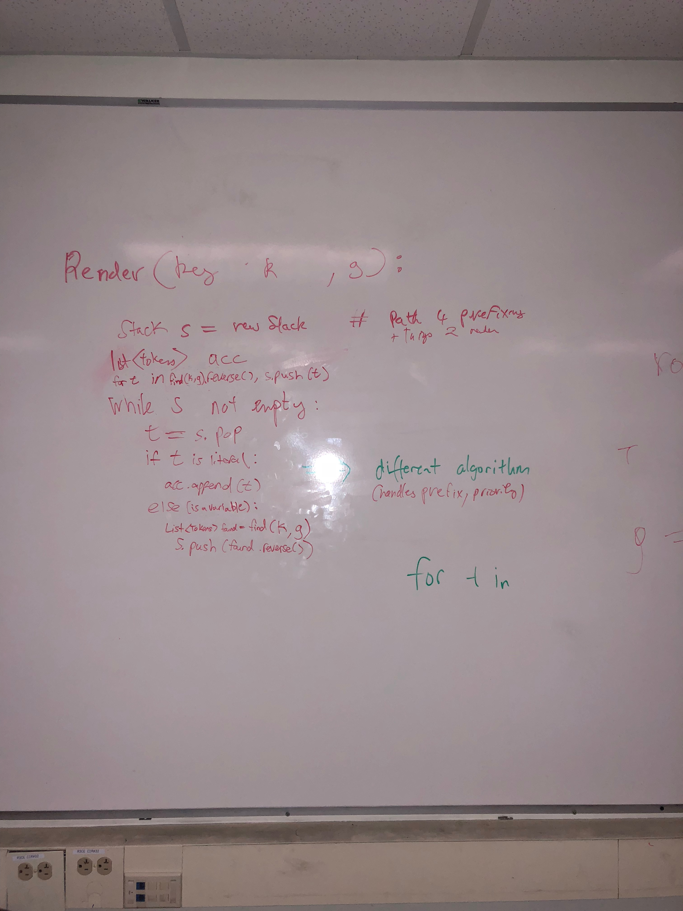
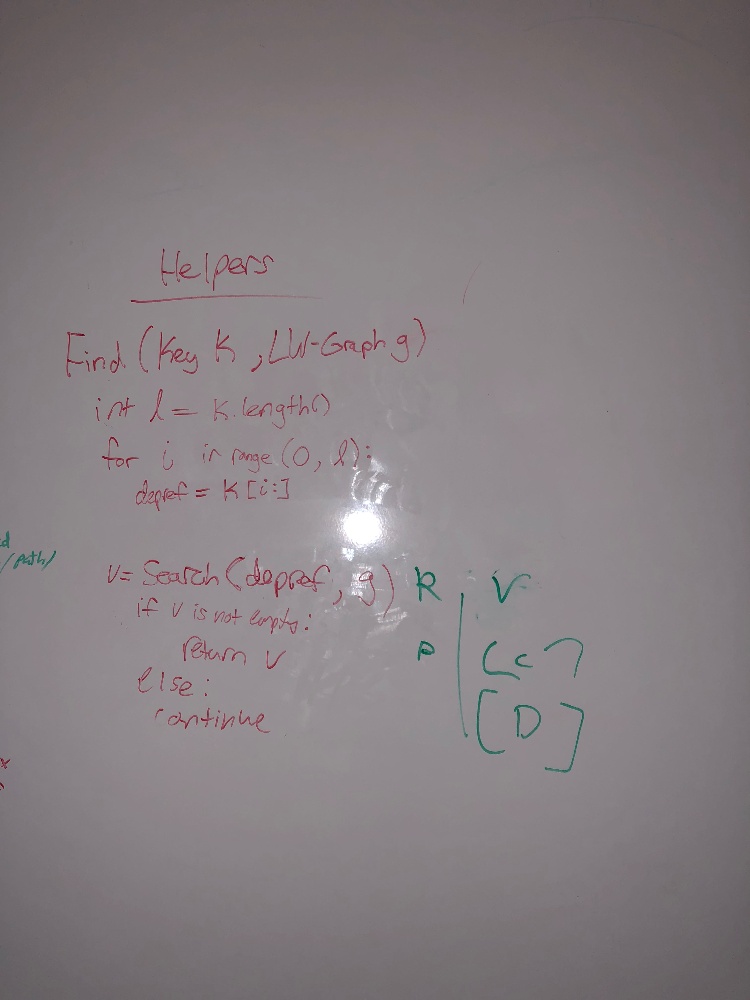
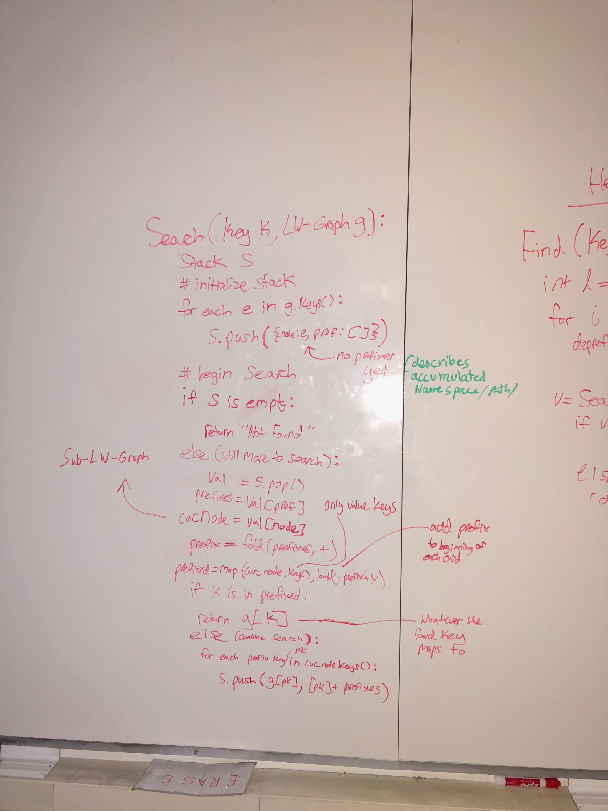
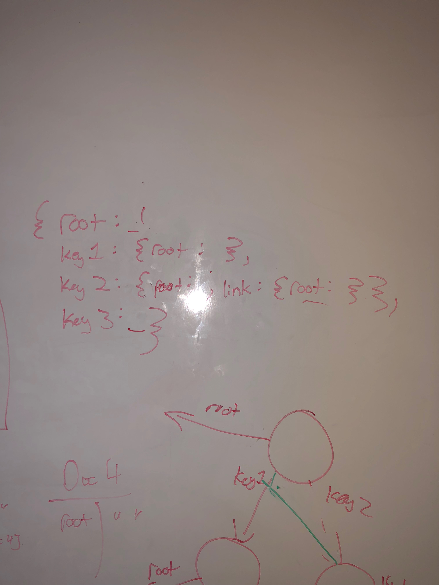

# Whiteboarding Notes

## Functions

We will have 4 functions

**Render** will render each token, calling find during its execution.

**Find** will find the location of each variable to be rendered. It houses deprefixing logic, and calls search during its execution.

**Search** is the function that actually searches the graph. It's essentially depth first search and calls no other functions.

Render:

Find:

Search:

## Data Structures

The primary data structures are

* Tokens (which can be literals, variables, or another LW-Graph aka a link)
* LW-Graph (Essentially an ordered dictionary of ordered dictionaries)

Example of a LW-Graph (ordering not shown). Note how each value that is not itself a dictionary is represented as a list of typed indexes ({literal : stand-in}, {variable: list<String> prefixes}).

